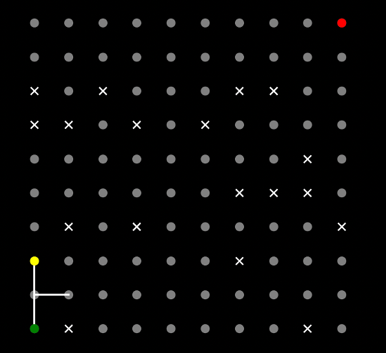
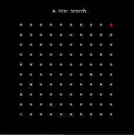
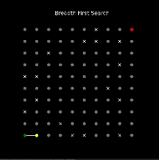

# Maze Solving Using Search Algorithms

## Introduction

This project is a maze-solving program that uses 3 search algorithms to find the shortest path from the start to the end of the maze. The 3 search algorithms used are:

1. Breadth-First Search
2. Depth First Search
3. A\* Search

The following is a sample maze:



Note that the maze is a 2D grid where the start is represented by a 'green circle' and the goal is represented by a 'red circle'. The obstacles are represented by 'X' and the empty spaces are represented by 'gray circles'. The yellow circles represent the agent moving from the start through the maze to the goal. The white lines represent the paths taken by the agent.

### Example of solving a 10x10 maze, with 20% obstacle density, using the 3 algorithms

### A\* Algorithm



### Breadth First Algorithm



### Depth First Algorithm


## Sample Results

The following are the results of the 3 algorithms solving a 10x10 maze with 20% obstacle density:

| Run     | Algorithm | Solution Path Length | Nodes Expanded | Algorithm Execution Time | Solution Found |
| ------- | --------- | -------------------- | -------------- | ------------------------ | -------------- |
| 1       | DFS       | 36.0                 | 53.0           | 7.7                      | 1.0            |
| 1       | BFS       | 18.0                 | 80.0           | 17.1                     | 1.0            |
| 1       | A\*       | 18.0                 | 80.0           | 17.0                     | 1.0            |
| 2       | DFS       | 0.0                  | 80.0           | 17.8                     | 0.0            |
| 2       | BFS       | 0.0                  | 80.0           | 17.5                     | 0.0            |
| 2       | A\*       | 0.0                  | 80.0           | 17.5                     | 0.0            |
| 3       | DFS       | 38.0                 | 39.0           | 4.4                      | 1.0            |
| 3       | BFS       | 18.0                 | 78.0           | 17.2                     | 1.0            |
| 3       | A\*       | 18.0                 | 78.0           | 17.4                     | 1.0            |
| 4       | DFS       | 28.0                 | 57.0           | 9.4                      | 1.0            |
| 4       | BFS       | 18.0                 | 81.0           | 17.7                     | 1.0            |
| 4       | A\*       | 18.0                 | 81.0           | 15.8                     | 1.0            |
| 5       | DFS       | 0.0                  | 81.0           | 16.0                     | 0.0            |
| 5       | BFS       | 0.0                  | 81.0           | 15.6                     | 0.0            |
| 5       | A\*       | 0.0                  | 81.0           | 15.6                     | 0.0            |
| 6       | DFS       | 0.0                  | 5.0            | 0.7                      | 0.0            |
| 6       | BFS       | 0.0                  | 5.0            | 0.7                      | 0.0            |
| 6       | A\*       | 0.0                  | 5.0            | 0.7                      | 0.0            |
| 7       | DFS       | 36.0                 | 46.0           | 4.7                      | 1.0            |
| 7       | BFS       | 18.0                 | 80.0           | 15.1                     | 1.0            |
| 7       | A\*       | 18.0                 | 80.0           | 14.9                     | 1.0            |
| 8       | DFS       | 44.0                 | 63.0           | 7.3                      | 1.0            |
| 8       | BFS       | 18.0                 | 83.0           | 14.9                     | 1.0            |
| 8       | A\*       | 18.0                 | 83.0           | 14.7                     | 1.0            |
| 9       | DFS       | 42.0                 | 43.0           | 4.1                      | 1.0            |
| 9       | BFS       | 18.0                 | 83.0           | 15.3                     | 1.0            |
| 9       | A\*       | 18.0                 | 83.0           | 15.2                     | 1.0            |
| 10      | DFS       | 32.0                 | 35.0           | 3.4                      | 1.0            |
| 10      | BFS       | 18.0                 | 81.0           | 14.5                     | 1.0            |
| 10      | A\*       | 18.0                 | 81.0           | 14.5                     | 1.0            |
| Average | A\*       | 12.6                 | 73.2           | 14.33                    | 0.7            |
| Average | BFS       | 12.6                 | 73.2           | 14.56                    | 0.7            |
| Average | DFS       | 25.6                 | 50.2           | 7.55                     | 0.7            |

## Repository Files Overview

The repository contains the following files:

1. `maze.py`: This file contains the maze class which is used to represent the maze and contains the methods to generate the maze, given the dimensions, start location, goal location, and obstacles density
2. `data_structures.py`: This file contains the data structures used in the search algorithms such as the stack, queue, and priority queue.
3. `algorithms.py`: This file contains the 3 search algorithms used to solve the maze. The algorithms are Breadth First Search, Depth First Search, and A\* Search. The file also contains the heuristic function used in the A\* Search algorithm, which is the Manhattan distance. Additionally, the file contains the function to visualize the algorithm progress and the solution path.
4. `trials_runner.py`: This file contains the class and methods used to run the search algorithms on the maze and collect the results. The results are then saved to a CSV file.
5. `cli.py`: This file contains the command line interface to run the maze-solving program.
6. `requirements.txt`: This file contains the required packages to run the program.
7. `README.md`: This file contains the project description, sample results, and the repository files overview.
8. `media`: This folder contains the images and gifs used in the README file.
9. `config.yaml`: This file contains the configuration parameters.

## Running the Program

To run the program, you need to have Python installed on your machine. The program was developed using Python 3.9.x. To run the program, follow the following steps:

1. Clone the repository to your local machine
2. Open the terminal and navigate to the repository folder
3. Run the following command to initialize the package and install the required dependencies:

```
 python3 -m pip install -e .
```

_Note: Using a virtual environment to install the package and its dependencies, such as conda virtual environments, is recommended._

4. Enter the `config.yaml` file and set the parameters for the maze. Description of the parameters are as follows:

   - `number_of_trials`: The number of trials to run the algorithms on the maze. The results of the trials are saved to a CSV file.
   - `maze_size`: The dimensions of the maze. The dimensions are a tuple of the number of rows and columns of the maze.
   - `start_location`: The start location of the maze. The start location is a tuple of the x and y coordinates of the start location.
   - `goal_location`: The goal location of the maze. The goal location is a tuple of the x and y coordinates of the goal location.
   - `obsticle_density`: The percentage of the maze that is occupied by obsticles. The obstacle density is a float between 0 and 1.
   - `results_saving_directory`: The directory to save the results of the trials. The results are saved to a CSV file.
   - `visualization_latency`: float number representing the time in seconds to wait between each step of the algorithm visualization. The visualization is used to show the progress of the algorithm.
   - `visualization_wait_until_close_time`: float number representing the time in seconds to wait while showing the final path. This is used to show the solution path after the algorithm is finished. Note that in case no solution is found, the visualization will show no solution found message.

5. Run the following command to start the program:

```
search-algorithms run
```

## Author

[Zaid Ghazal](https://www.linkedin.com/in/zaid-ghazal/)
